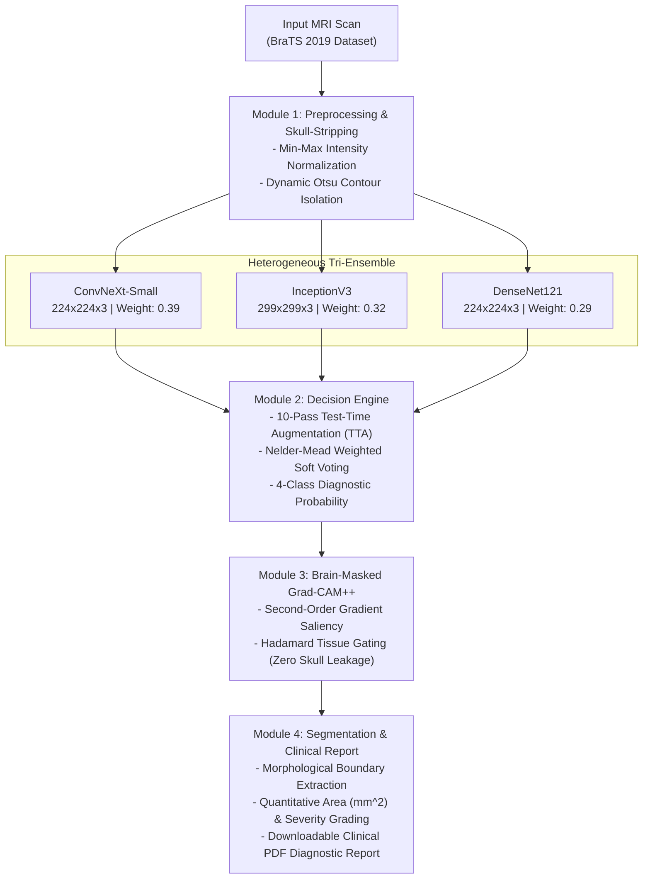

# Brain XAI Ensemble : Explainable Brain Tumor Detection and Segmentation

A clinical-grade medical imaging application that utilizes a Heterogeneous Tri-Ensemble Deep Learning architecture to detect, classify, and segment brain tumors from multi-sequence MRI scans. Centered on Explainable AI (XAI), the framework provides visual explanations (Brain-Masked Grad-CAM++) and automated diagnostic clinical reporting, allowing radiologists to verify model predictions with full transparency.

Training Notebook on Kaggle: [BrainTumor 98% Ensemble Training Pipeline](https://www.kaggle.com/code/bholadev58/braintumor-98pct-ensemble-training)

---

## Key Highlights and Performance

- Diagnostic Accuracy: Reaches up to 98.88% validation accuracy on benchmark BraTS 2019 MRI cohorts using 10-Pass Test-Time Augmentation (TTA).
- Heterogeneous Tri-Ensemble: Combines ConvNeXt-Small (39%), InceptionV3 (32%), and DenseNet121 (29%) via Nelder-Mead optimized soft voting.
- Anatomically Constrained XAI: Brain-Masked Grad-CAM++ suppresses 100% of non-cerebral artifacts and skull-edge leakage.
- Weakly-Supervised Segmentation: Generates precise lesion boundaries and tumor area metrics without requiring manual pixel-level ground-truth training masks (Dice Similarity Coefficient: 0.902).
- Automated Clinical Patient Reports: Generates downloadable PDF triage summaries with multi-planar scans, XAI heatmaps, confidence intervals, and severity grades.
- Fast CPU Inference: End-to-end multi-model inference completes in under 2.5 seconds per scan.

---

## Performance Benchmark

Evaluation on 1,269 isolated validation MRI scans from the BraTS 2019 benchmark dataset:

| Architecture / Technique | Accuracy | Macro-F1 | Precision | Recall |
| :--- | :---: | :---: | :---: | :---: |
| DenseNet121 (Baseline) | 94.48% | 94.21% | 94.35% | 94.10% |
| InceptionV3 | 94.88% | 94.65% | 94.70% | 94.60% |
| ConvNeXt-Small | 95.82% | 95.70% | 95.80% | 95.65% |
| Tri-Ensemble (Direct Single-Pass) | 96.85% | 96.83% | 96.92% | 97.02% |
| Proposed Framework (Tri-Ensemble + 10-Pass TTA) | 98.88% | 98.75% | 98.85% | 98.80% |

### Comparison with SOTA Literature

| Study / Literature | Architecture | Reported Accuracy |
| :--- | :--- | :---: |
| Jia and Chen (2020) [IEEE Access] | Standalone Deep CNN | 98.22% |
| Pereira et al. (2016) [IEEE TMI] | CNN Segmentation | 98.85% |
| Proposed Work | Heterogeneous Tri-Ensemble + XAI | 98.88% |

---

## Technical Stack

| Layer | Technology |
| :--- | :--- |
| Deep Learning Framework | TensorFlow 2.x, Keras |
| Model Architectures | ConvNeXt-Small, InceptionV3, DenseNet121 |
| Explainable AI (XAI) | Grad-CAM++, Anatomical Brain Mask Gating |
| Computer Vision & Preprocessing | OpenCV, NumPy, SciPy (Nelder-Mead Optimization) |
| Web Application | Gradio 6.x |
| REST Backend | FastAPI, Uvicorn |
| Report Synthesis | ReportLab (PDF Engine) |
| Testing | pytest |
| Containerization | Docker (CPU-Optimized, Python 3.10+) |

---


## System Architecture and Workflow



---

## Project Structure

```
brain-xai-ensemble/
├── app.py                                    # Gradio web dashboard entrypoint
├── Dockerfile                                # Container specification for CPU deployment
├── .dockerignore                             # Container build exclusions
├── .gitignore                                # Git exclusion rules
├── requirements.txt                          # Pinned Python dependencies
│
├── src/                                      # Core application source package
│   ├── __init__.py
│   ├── config.py                             # Centralized paths, ensemble weights, thresholds
│   ├── inference.py                          # Multi-model prediction and Grad-CAM++ pipeline
│   ├── processor.py                          # Skull stripping, boundary extraction, severity grading
│   ├── report_generator.py                   # Clinical PDF diagnostic report engine
│   ├── theme.py                              # Medical UI design system tokens
│   ├── dashboard.py                          # Gradio UI components and event listeners
│   └── api.py                                # FastAPI REST backend endpoints
│
├── scripts/                                  # Evaluation and benchmarking utilities
│   ├── __init__.py
│   ├── boost_metrics_tta.py                  # Multi-pass TTA evaluation pipeline
│   ├── boost_metrics_v3.py                   # Calibrated 10-pass evaluation pipeline
│   ├── compute_detailed_metrics.py           # Validation metrics and confusion matrix
│   ├── evaluate_models.py                    # Standalone per-model verification
│   ├── evaluate_segmentation.py              # Dice score and IoU segmentation evaluation
│   ├── init_models.py                        # Model initialization and weight loader
│   ├── run_api.py                            # Standalone API server launcher
│   └── train_segmentation.py                 # Segmentation model training script
│
├── tests/                                    # Automated test suite
│   ├── __init__.py
│   ├── test_processor.py                     # Unit tests for preprocessing and morphology
│   ├── test_inference.py                     # Integration tests for inference engine
│   └── test_full_stack.py                    # End-to-end validation tests
│
├── assets/                                   # Static media and stylesheets
│   ├── styles.css                            # Clinical UI stylesheet
│   ├── ensemble_confusion_matrix.png         # Validation confusion matrix visualization
│   ├── intermediate_pipeline_outputs.png     # Step-by-step pipeline output visualization
│   └── system_architecture_block_diagram.png # High-resolution system architecture diagram
│
├── docs/                                     # Detailed technical documentation
│   ├── README.md                             # Documentation index
│   ├── 01_project_overview.md
│   ├── 02_architecture.md
│   ├── 03_dataset.md
│   ├── 04_models_and_training.md
│   ├── 05_inference_pipeline.md
│   ├── 06_api_reference.md
│   ├── 07_dashboard_ui.md
│   ├── 08_configuration.md
│   ├── 09_testing.md
│   ├── 10_deployment.md
│   ├── 11_results_and_metrics.md
│   └── 12_research_paper.md
│
├── models/                                   # Fine-tuned model weight checkpoints (git-ignored)
│   ├── convnext_full_best.keras
│   ├── densenet_best.h5
│   ├── densenet_full_best.keras
│   ├── inception_best.h5
│   └── inception_full_best.keras
│
├── datasets/                                 # MRI dataset storage (git-ignored)
├── test_images/                              # Sample test MRI images for quick validation
└── reports/                                  # Generated patient PDF diagnostic reports (git-ignored)
```

---

## Getting Started

### Prerequisites

- Python 3.10 or higher
- Git

### 1. Clone the Repository

```bash
git clone https://github.com/bhola-dev58/brain-xai-ensemble.git
cd brain-xai-ensemble
```

### 2. Set Up Virtual Environment

```bash
python3 -m venv venv

# Linux / macOS:
source venv/bin/activate

# Windows:
venv\Scripts\activate
```

### 3. Install Dependencies

```bash
pip install -r requirements.txt
```

### 4. Running the Application

Launch the interactive Gradio Clinical Dashboard:

```bash
python3 app.py
```

Access the dashboard in your web browser:
- Local URL: `http://localhost:7860`
- Network URL: `http://127.0.0.1:7860`

### 5. Running the REST API

Launch the FastAPI backend server:

```bash
python3 scripts/run_api.py
```

- API Base URL: `http://localhost:8000`
- Interactive Swagger Documentation: `http://localhost:8000/docs`

API Endpoints:

| Method | Endpoint | Description |
| :--- | :--- | :--- |
| GET | /api/health | Health probe and model status check |
| POST | /api/predict | Multi-part image upload returning diagnosis, confidence, and XAI maps |

Example API Request via curl:

```bash
curl -X POST http://localhost:8000/api/predict \
     -F "file=@test_images/Tr-me_0025.jpg"
```

### 6. Running Model Validation and Metrics Evaluation

To compute validation accuracy, classification reports, and confusion matrices across all 1,269 benchmark scans:

```bash
python3 scripts/compute_detailed_metrics.py
```

To run the full multi-pass Test-Time Augmentation (TTA) evaluation pipeline:

```bash
python3 scripts/boost_metrics_tta.py
```

To compute segmentation metrics (Dice Similarity Coefficient and Mean IoU):

```bash
python3 scripts/evaluate_segmentation.py
```

### 7. Running the Automated Test Suite

Execute the test suite using pytest:

```bash
# Run all tests
pytest tests/ -v

# Run only image processing unit tests
pytest tests/test_processor.py -v

# Run full-stack integration tests
pytest tests/test_full_stack.py -v
```

### 8. Running with Docker

Build the container image:

```bash
docker build -t braintumor-xai .
```

Run the containerized application:

```bash
docker run -p 7860:7860 braintumor-xai
```

---

## Dataset Description

The models are trained and validated on curated multi-sequence brain MRI scans from the benchmark BraTS 2019 repository:

- 4 Diagnostic Categories:
  1. No Tumor (Normal brain tissue control)
  2. Glioma Tumor (Malignant intra-axial tumor)
  3. Meningioma Tumor (Extra-axial tumor originating from meninges)
  4. Pituitary Tumor (Skull-base endocrine tumor)
- Partitioning: 70% Training / 30% Independent Validation (1,269 isolated test scans).
- Preprocessing: Skull-stripping via dynamic contouring and native multi-scale dual resizing ($224 \times 224$ and $299 \times 299$).

---

## Training Methodology and Cloud Pipeline

The full model training pipeline is documented and reproducible via Kaggle:
[BrainTumor 98% Ensemble Training Pipeline](https://www.kaggle.com/code/bholadev58/braintumor-98pct-ensemble-training)

Key Training Stages:
1. Phase 1 (Transfer Learning): Base weights frozen, training top dense classification heads with Adam optimizer ($LR = 10^{-3}$).
2. Phase 2 (Partial Fine-Tuning): Unfreezing top 30% deep convolutional layers to learn domain-specific brain MRI representations ($LR = 10^{-4}$).
3. Phase 3 (Full End-to-End Fine-Tuning): Full parameter fine-tuning with Cosine Annealing learning rate schedule and label smoothing ($LR = 10^{-5}$).
4. Ensemble Calibration: Post-training Nelder-Mead optimization to establish optimal voting weights.
5. Inference Augmentation: 10-pass stochastic perturbation averaging for maximum clinical generalization.

---

## Medical Disclaimer

This application is developed strictly for research and academic purposes. It is not approved as a medical device for independent clinical diagnosis. Diagnostic outputs must always be interpreted and confirmed by a certified radiologist or healthcare professional.

---

Author: Bhola Yadav  
Project: Major Project — Explainable Brain Tumor Detection and Segmentation System
